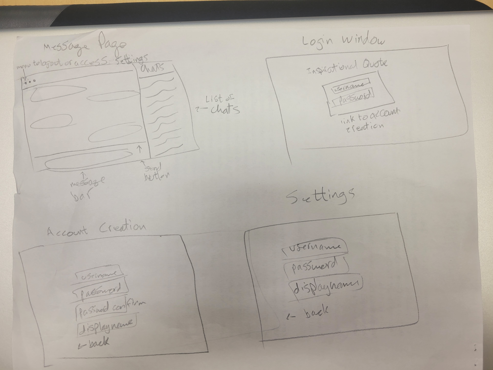

[notes reference file](./notes.md)
# Startup Assignment
## Elevator Pitch
FastChat is a web application that allows for instant messaging between profiles, including group chats. It's free, updates messages instantly, and can be used from anywhere because it is based out of a browser. Users can get their accounts for free, customize their display name, and contact any other user on the platform. Conversations persist between sessions and users can easily see their conversations on their side panel.
## Features
* Main messaging window: displays messages in the current conversation and allows new messages to be recieved and sent. Also contains the chats panel.
    * Chats panel: side panel listing other users that the current user can chat with.
    * Main messaging window contains options to log-out or access settings
* Login window: allows the user to login in order to access their messages or provides functionality to create a new account.
    * Login window contains link to the account creation page.
    * Also displays an inspirational quote on the Login window.
* Account Creation Page: lets the user set their display name, login username, and login password.
    * Account Creation Page contains a back link to the login page
* Settings page: allows users to edit their display name and login credentials.
    * Settings page contains a link back to the main messaging window
## Technologies
* HTML: Structure of the side panel, login window, and chat window will all be in HTML.
* CSS: Styling of all the windows, including colors and animation of sending/receiving messages, and appearance of side panel will be accomplished using CSS.
* JavaScript: Used to manage and manipulate the CSS, access and edit HTML elements, and display data received from Web Sockets. JavaScript will also access third party services for the quote of the day.
* Web Service Calls: Displays an inspirational quote on the login screen by calling a third party quote service.
* Web Service Provision: Provides services with back and forth contact with the server and allowing the user to access the FastChat application Calls the server that provides data about what other running instances of the web application.
* Authentication: Users create an account and then use their account to login each time they access the web application.
* Database Persistence: Login info, chats (recipients, titles), and messages persist accross each web app session by being stored in a cloud database and accessed by the web application.
* Web Sockets: Used to render realtime reception and sending of messages while the user is using the application. Also used to access the quote of the day for the login page.
## Design Draft

## HTML Deliverable
For this deliverable, I added the application structure.
* HTML pages: 4 HTML pages for each "view" the user can access. This includes the login page (index.html), the account creation page, the main messaging page, and the settings page.
* Links: The bottom of each page includes a link to the public github repository. The submit buttons are a part of form elements that follow specific links to other pages in the application.
* Text: Messages, conversations, the inspirational quote, and text field labels are represented with the necessary text to describe the structure of the application.
* Images: The header of each page includes the head background image imbedded in the HTML.
* Login placeholder: login page (index.html) contains text fields for the user to input their username and password. Username is displayed in the header of messageHome.html once the user logs in.
* Database data: messageHome.html lists other users in the data base that the current user can select to chat with (under the "Conversations" section).
* WebSocket data: messageHome.html lists messages in the current chat that will be updated live through WebSockets as other users message the current user through the server (under "Conversation with User2" section).